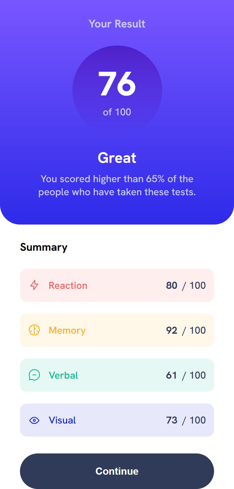

# Frontend Mentor - Results summary component solution

This is a solution to the [Results summary component challenge on Frontend Mentor](https://www.frontendmentor.io/challenges/results-summary-component-CE_K6s0maV).

## Table of contents
- [The challenge](#the-challenge)
- [My process](#my-process)
- [Screenshot](#screenshot)
- [Links](#links)
- [Built with](#built-with)
- [What I learned](#what-i-learned)

## The challenge
Your users should be able to:

- View the optimal layout for the interface depending on their device's screen size
- See hover and focus states for all interactive elements on the page

## My process
I focused on using semantic HTML and clean CSS variables to match the design as closely as possible.

### Built with
- Semantic HTML5 markup
- CSS custom properties (Variables)
- Flexbox
- CSS Clamp for responsiveness
- @media screen

### What I learned
- I got the better understanding of clamp()

## Screenshot

## Links

- Solution URL: [Solution URL](https://github.com/Faith-Rose1/Results-summary-component)
- Live Site URL: [Live Site URL](https://faith-rose1.github.io/Results-summary-component/)

## Author
- Frontend Mentor - [@Faith-Rose1](https://www.frontendmentor.io/profile/Faith-Rose1)